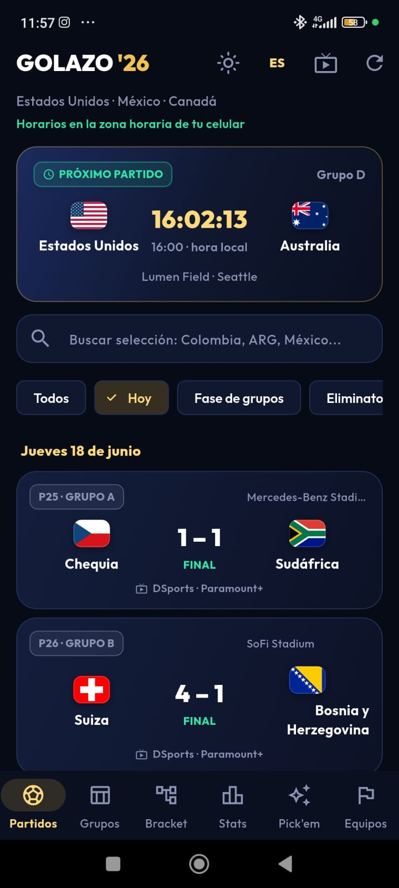
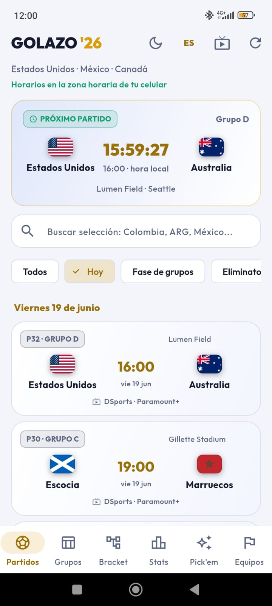
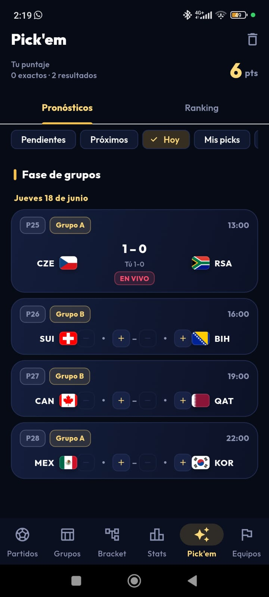
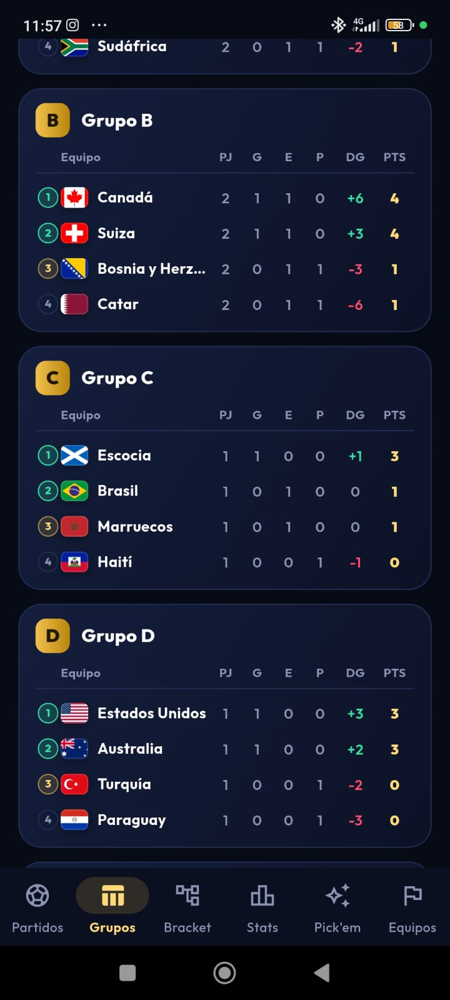
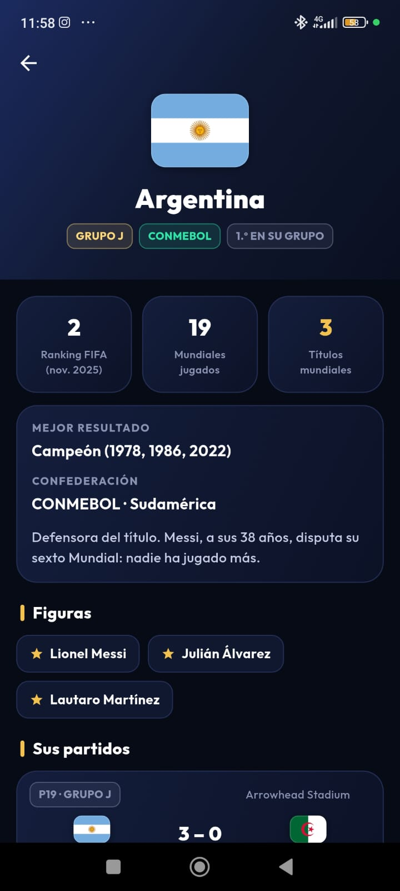
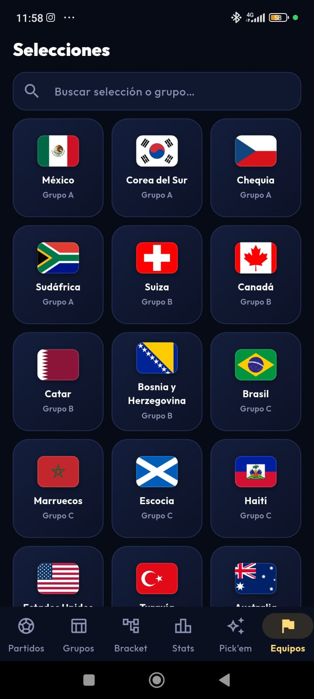
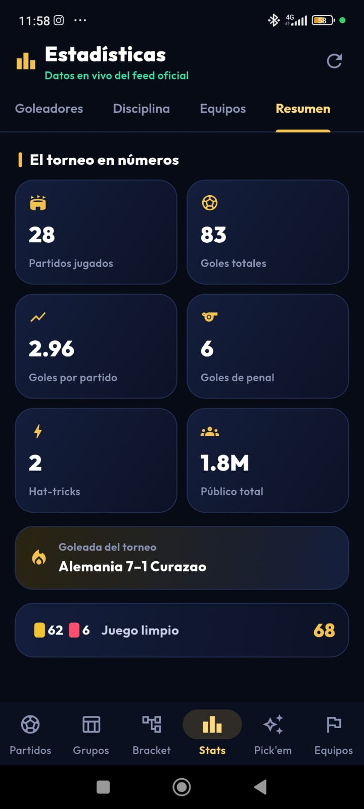
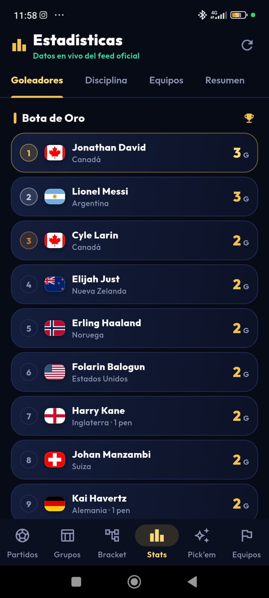

# Capturas

Pantallas de la app en modo claro y oscuro.

## Inicio

{ width="240" }
{ width="240" }

## Predicciones (Pick'em)

{ width="240" }

## Fase de grupos

{ width="240" }

## Equipos

{ width="240" }
{ width="240" }

## Estadísticas

{ width="240" }
{ width="240" }

